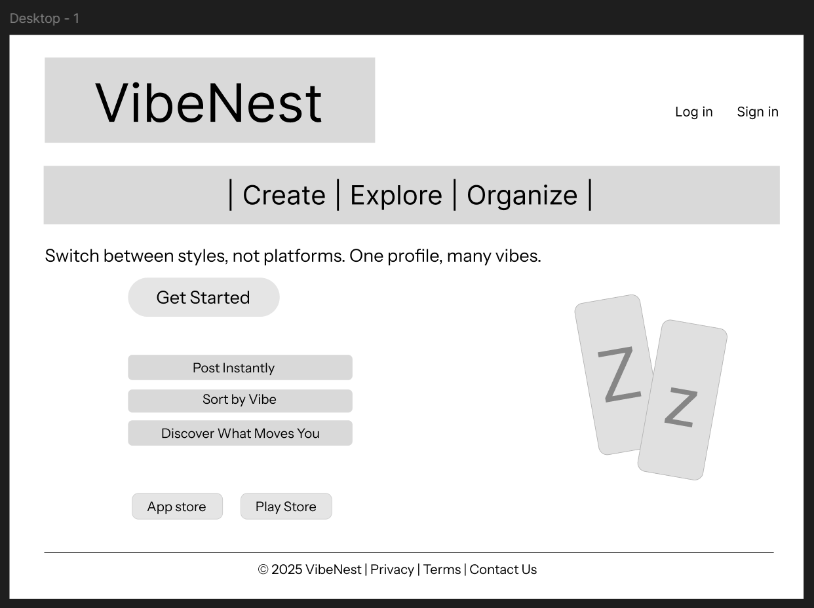

# VibeNest Wireframe 🎨

This is a low-fidelity wireframe for the **VibeNest** landing page — created using Figma.

---

## 🔗 View the Design

👉 [Click to view the Figma design](https://www.figma.com/design/nMZlaZT3hDW3wY2g1MUObG/wireframe?node-id=0-1&t=xc52599Ad7kKfvt4-1)

---

## 📐 Frame Size

- Width: 1440 px
- Height: Responsive (based on content)
- Tools Used: Figma

---

## 📸 Preview

---

## ✏️ Sections Included
- Header navigation
- Main headline and CTA
- Features section
- App store buttons
- Phone mockups
- Footer

---

> This is part of a UI/UX design learning project.

